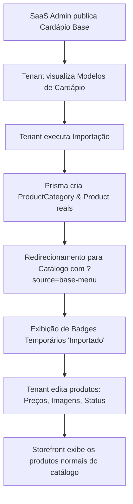

# Fluxo de Importação de Cardápio Pronto (Tenant)

Este documento descreve o funcionamento do fluxo de importação de Cardápios Base/Prontos pelo Lojista (Tenant) e o comportamento do catálogo pós-importação.

## 1. Princípios do Fluxo de Importação

* **Cópia Independente:** O Cardápio Base funciona apenas como um modelo (template). Quando o lojista executa a importação, o sistema realiza uma cópia física profunda das categorias e dos produtos para o catálogo exclusivo do tenant.
* **Sem Sincronização Automática:** Não existe acoplamento nem sincronização contínua entre o template de origem e os produtos criados. Uma vez importado, o produto vira um produto normal do tenant e pode ser modificado livremente.
* **Propriedade do Tenant:** O lojista não edita o Cardápio Base do SaaS, mas sim as cópias locais criadas sob seu próprio `tenantId`.
* **Idempotência (Skip Existing):** O fluxo de importação é projetado para evitar duplicação. Categorias e produtos que já possuem correspondência exata de nome ou slug no catálogo do lojista são ignorados automaticamente durante o processo de reimportação.

## 2. Ciclo de Vida do Produto Pós-Importação

## 3. Recomendações Pós-Importação para o Lojista

Após a conclusão da importação bem-sucedida, é altamente recomendado que o lojista:
1. **Revisar Preços:** Os preços definidos no template do SaaS Admin são meramente sugestivos (basePrice). O lojista deve ajustar a tabela de preços conforme sua realidade local e custos operacionais.
2. **Revisar Imagens:** O sistema faz a correspondência automática de imagens usando tags e chaves globais da galeria. Caso algum produto não tenha imagem vinculada, o storefront exibirá o placeholder correto, e o lojista poderá enviar sua própria imagem na aba de edição.
3. **Ativar/Desativar Produtos:** Por padrão, todos os produtos importados são criados com status `Ativo/Disponível`. Caso o lojista não trabalhe com determinados itens importados, ele deve pausar ou esgotar esses produtos na lista.
4. **Validar no Storefront:** Acessar o link do seu storefront delivery/balcão para confirmar a organização visual das novas categorias e produtos importados.
