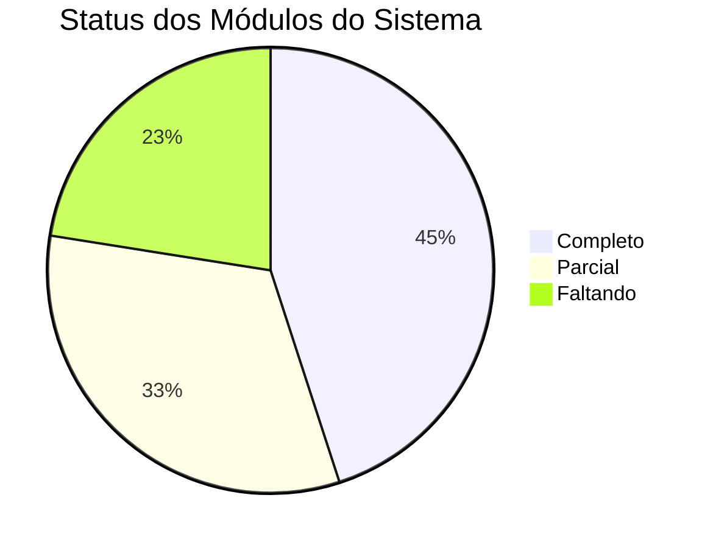

# 🔍 Análise Sistemática Completa — Gestor Delivery SaaS PRO

> **Data:** 27/04/2026 · **Fonte da verdade:** código-fonte

---

## 1. Arquitetura do Monorepo

| Camada | Pacote | Tecnologia | Estado Geral |
|--------|--------|-----------|--------------|
| API | `apps/api` | NestJS + Prisma | 🟡 Funcional com problemas |
| Dashboard Tenant | `apps/web-tenant` | Vite + React + Tailwind | 🟢 Funcional |
| Storefront | `apps/web-storefront` | Vite + React + Tailwind | 🟡 Funcional com bugs |
| Admin SaaS | `apps/web-admin` | Vite + React + Tailwind | 🔴 Mínimo viável |
| App Entregador | `apps/web-delivery` | Vite + React | 🔴 Protótipo |
| Types | `packages/types` | TypeScript | 🟡 Funcional |
| Packages (auth/config/core/ui/utils) | `packages/*` | TypeScript | 🟡 Parcial |

---

## 2. Problemas Críticos Encontrados

### 2.1. 🔴 Módulos Duplicados no `app.module.ts`

Os seguintes módulos são importados **duas vezes** no [app.module.ts](file:///c:/Users/emers/Documents/GitHub/Gestor%20Delivery%20SaaS%20PRO/apps/api/src/app.module.ts):

| Módulo | Linhas |
|--------|--------|
| `CrmModule` | L25 e L108 |
| `PromotionsModule` | L26 e L111 |
| `InventoryModule` | L27 e L114 |
| `AnalyticsModule` | L28 e L117 |
| `GoalsModule` | L29 e L120 |
| `PosModule` | L24 e L129 |

> [!CAUTION]
> NestJS pode criar instâncias duplicadas de providers, causando comportamento imprevisível, memory leaks e conflitos de injeção de dependência.

**Correção**: Remover as importações duplicadas (linhas 86-120).

---

### 2.2. 🔴 Divergências nos Arquivos `.env`

#### `.env` raiz vs `.env.example`

| Variável | `.env` | `.env.example` | Status |
|----------|--------|----------------|--------|
| `RATE_LIMIT_*` (6 vars) | ❌ Ausente | ✅ Presente | ⚠️ Usa defaults |
| `SWAGGER_ENABLED` / `SWAGGER_PATH` | ❌ Ausente | ✅ Presente | ⚠️ Usa defaults |
| `VITE_GOOGLE_MAPS_KEY` | ✅ Presente | ❌ Ausente | 🔴 Faltando no example |
| `WHATSAPP_CLOUD_*` (4 vars) | ❌ Ausente nos dois | ✅ Requerido em `env.validation.ts` | ⚠️ Usa defaults vazios |

#### `.env` do `apps/api`:
- Tem JWT_SECRET com valor placeholder `"your-super-secret-jwt-key-change-in-production"` — inseguro para qualquer ambiente
- Porta do DB é `5433`, diferente do `.env.example` que mostra `5432`

#### `.env` do `apps/web-storefront`:
- Contém `VITE_GOOGLE_MAPS_KEY` e `VITE_API_URL` — **único app com `.env` próprio**
- `web-tenant, web-admin, web-delivery` **NÃO TÊM** `.env` individuais (devem ter para `VITE_API_URL`)

---

### 2.3. 🔴 `web-delivery` — Protótipo Não-Funcional

O app de entregador ([App.tsx](file:///c:/Users/emers/Documents/GitHub/Gestor%20Delivery%20SaaS%20PRO/apps/web-delivery/src/App.tsx)) contém:

- ❌ **URL hardcoded** `http://localhost:3000` — porta errada (API roda na 3333)
- ❌ Sem autenticação — `driverId` vem do `localStorage` com fallback `'temp-driver-id'`
- ❌ Sem roteamento — tudo num único componente
- ❌ Sem integração real com a API
- ❌ Sem manifest/PWA/service worker (previsto no roadmap como PWA)
- ❌ Dados `0` hardcoded para "Pedidos Hoje"

---

### 2.4. 🟡 `PaymentInput` DTO — Campos Soltos

O `PaymentInput` contém `couponCode` e `useCashbackAmount`, mas esses mesmos campos **já existem** diretamente no `CreateOrderDTO`. Isso gera ambiguidade sobre qual campo a API realmente lê.

```diff
// PaymentInput (order.ts L24-29)
  couponCode?: string;        // ← duplicado
  useCashbackAmount?: number;  // ← duplicado

// CreateOrderDTO (order.ts L187-188)
  couponCode?: string;        // ← fonte primária
  useCashbackAmount?: number; // ← fonte primária
```

---

### 2.5. 🟡 `web-admin` — Extremamente Limitado

O painel SaaS Admin ([App.tsx](file:///c:/Users/emers/Documents/GitHub/Gestor%20Delivery%20SaaS%20PRO/apps/web-admin/src/App.tsx)) possui apenas **3 rotas**:
- `/dashboard`
- `/tenants`
- `/tenants/:tenantId/modules`

**Faltando** para um admin SaaS completo:
- Gestão de planos/billing
- Relatórios financeiros globais
- Logs de auditoria
- Impersonação de tenant (citado em conversas anteriores)
- Gestão de permissões admin

---

## 3. Mapa de Status por Módulo

### ✅ Completo (funcional e integrado)

| Módulo | Backend | Frontend | Observações |
|--------|---------|----------|-------------|
| **Autenticação Tenant** | ✅ | ✅ | Login/logout, JWT+Refresh, guards |
| **RBAC** | ✅ | ✅ | Permissões, PermissionGate no frontend |
| **Catálogo (Produtos)** | ✅ | ✅ | CRUD com editor V2, duplicação |
| **Catálogo (Categorias)** | ✅ | ✅ | CRUD completo |
| **Catálogo (Opções/Complementos)** | ✅ | ✅ | Grupos de opção, itens, links |
| **Catálogo (Combos V2)** | ✅ | ✅ | Slots e bundles |
| **Pedidos (Checkout Público)** | ✅ | ✅ | Validação server-side, entrega, PIX |
| **Pedidos (Lista/Board/KDS)** | ✅ | ✅ | Kanban, KDS, listagem |
| **Caixa (Cash Register)** | ✅ | ✅ | Abertura/fechamento, movimentações |
| **Cupons/Promoções** | ✅ | ✅ | CRUD + aplicação no checkout |
| **CRM (Clientes)** | ✅ | ✅ | Listagem, OTP, cashback |
| **Delivery (Motoristas)** | ✅ | ✅ | CRUD, despacho, mapa |
| **Delivery (Zonas/Taxas)** | ✅ | ✅ | Polígonos, distância, bairro |
| **Estoque/Ingredientes** | ✅ | ✅ | Receitas, movimentações |
| **Configurações do Tenant** | ✅ | ✅ | Dados fiscais, endereço, métodos pgto |
| **Upload de Imagens** | ✅ | ✅ | Static files com express |
| **PDV (POS)** | ✅ | ✅ | Modo completo + Modo Garçom |
| **Horários de Funcionamento** | ✅ | ✅ | Schema/API presentes |

### 🟡 Parcial (backend existe, frontend parcial/bugs)

| Módulo | Backend | Frontend | O que falta |
|--------|---------|----------|-------------|
| **Storefront (Tracking)** | ✅ | 🟡 | Token público funciona, mas UX de tracking é básica |
| **Agendamento** | ✅ | 🟡 | Selector funcional, mas sem gestão admin de slots |
| **Relatórios/Analytics** | ✅ | 🟡 | Página existe mas dados podem ser mock |
| **Metas (Goals)** | ✅ | 🟡 | Página existe mas dados podem ser mock |
| **Split Payment** | ✅ | 🟡 | Backend completo, uso no frontend é limitado ao POS |
| **Compras (Purchasing)** | ✅ | 🟡 | CRUD funcional mas sem fluxo de aprovação robusto |
| **Finanças** | ✅ | 🟡 | Página funcional, export/nova transação implementados |
| **Contagem de Inventário** | ✅ | 🟡 | CRUD funcional mas sem relatório de divergência |
| **Upsells** | ✅ | 🟡 | CRUD existe, exibição no storefront pode não funcionar |
| **Fornecedores** | ✅ | 🟡 | CRUD funcional |
| **Auth Cliente (B2C)** | ✅ | 🟡 | Login por OTP funciona, mas sem registro completo |
| **Perdas** | ✅ | 🟡 | Tela básica implementada |
| **Funcionários** | ✅ | 🟡 | Tela de listagem |

### 🔴 Faltando / Incompleto

| Módulo | Backend | Frontend | Status |
|--------|---------|----------|--------|
| **App Entregador (PWA)** | ✅ (API existe) | 🔴 Protótipo | Apenas 3 arquivos, sem auth, URL errada |
| **Admin SaaS Completo** | 🟡 | 🔴 Mínimo | Apenas 3 telas (login/dash/tenants) |
| **Billing/Planos** | ✅ | 🔴 | Sem tela de gestão de planos |
| **Onboarding Guiado** | ✅ Schema | 🔴 | Schema `TenantOnboarding` existe, sem UI |
| **Audit Logs** | ✅ Schema | 🔴 | Schema `AuditLog` existe, sem visualização |
| **Impressão (Print Jobs)** | ✅ Schema | 🔴 | Schema/model existe, sem integração hardware |
| **Gateway de Pagamento Online** | 🟡 | 🔴 | Módulo existe, integração MercadoPago parcial |
| **Notificações Push/WhatsApp** | 🟡 | 🔴 | env.validation espera WhatsApp vars, sem implementação completa |
| **Multi-unidade (Business Group)** | 🟡 Schema | 🔴 | Schema `BusinessGroup` existe, sem gestão UI |

---

## 4. Desalinhamentos UI ↔ Backend ↔ Schema

### 4.1. Enum Casing Inconsistente

Os enums no Prisma usam `lowercase` (ex: `active`), enquanto no `packages/types/src/enums.ts` alguns usam `UPPERCASE` como key:

```diff
// Prisma: enum PurchaseStatus { draft, pending, received, cancelled }
// Types:  enum PurchaseStatus { DRAFT = 'draft', PENDING = 'pending', ... }
```

Isso funciona porque os **valores** são lowercase, mas pode causar confusão ao referenciar (ex: `PurchaseStatus.DRAFT` vs `'draft'`).

### 4.2. `FulfillmentType` — `table` vs `dine_in`

O schema Prisma define `table` e `dine_in` como valores separados no enum `FulfillmentType`. No checkout do storefront, apenas `delivery` e `pickup` são oferecidos ao cliente. Os tipos `dine_in` e `table` são usados apenas no POS/Waiter, o que é correto, mas a UI do POS precisa garantir que envia o enum correto.

### 4.3. Storefront não oferece `credit_card` / `debit_card`

O checkout do storefront só mostra `pix`, `card_on_delivery` e `cash`. Os métodos `credit_card` e `debit_card` existem no enum `PaymentMethod` mas não são oferecidos online — isso é intencional se não há gateway online, mas deve ser documentado.

---

## 5. Problemas de Qualidade de Código

### 5.1. Arquivos Temporários de Debug na Raiz dos Apps

Múltiplos arquivos de logs/erros espalhados incorretamente:

**Na raiz do monorepo:**
- `api_lint.txt`, `build_errors.txt`, `build_log.txt`, `tsc_api_errors.txt`, `web_tenant_errors.txt`, `web_tenant_lint.txt`, `web_tenant_lint_new.txt`, `schema_content.txt`, `tsc_api_utf8.txt`

**Em `apps/api/`:**
- `api_lint_detail.txt`, `error.log`, `full_crash.log`, `seed_error.log`, `tsc_errors.txt` (múltiplos), `tmp_hash.txt`, etc.

**Em `apps/web-tenant/`:**
- `errors.txt`, `lint_output.txt`, `tsc_errors.log`, etc.

> [!WARNING]
> Esses arquivos devem ser adicionados ao `.gitignore` e removidos do repositório.

### 5.2. Arquivos de Test Avulsos

Scripts de teste soltos na raiz e no `apps/api/`:
- `test-e2e-products.js`, `test-pdv-storefront.js` (raiz)
- `test-availability.js`, `test-checkout-v2.js`, `test-v2-flow.js`, `check-db.js` etc (api)

Devem ser organizados num diretório `__tests__` ou `scripts/tests/`.

### 5.3. Lock File Duplicados

```
pnpm-lock.yaml.1301465730
pnpm-lock.yaml.2365365514
pnpm-lock.yaml.2460739485
```

Conflitos de merge não resolvidos. Devem ser removidos.

### 5.4. Dois `ErrorBoundary` no Storefront

```
components/ErrorBoundary.tsx  (2303 bytes)
components/error-boundary.tsx (1087 bytes)
```

Arquivo duplicado com nomes diferentes — pode causar import errado.

---

## 6. Status das Variáveis de Ambiente

### Variáveis Requeridas pelo Sistema

| Variável | `.env` raiz | `.env.example` | `api/.env` | `env.validation.ts` |
|----------|-------------|----------------|------------|---------------------|
| `DATABASE_URL` | ✅ | ✅ | ✅ | ✅ required |
| `JWT_SECRET` | ✅ | ✅ | ✅ (placeholder!) | ✅ min 16 chars |
| `JWT_REFRESH_SECRET` | ✅ | ✅ | ✅ (placeholder!) | ✅ min 16 chars |
| `JWT_EXPIRES_IN` | ✅ | ✅ | ✅ | ✅ default 15m |
| `JWT_REFRESH_EXPIRES_IN` | ✅ | ✅ | ✅ | ✅ default 7d |
| `API_PORT` | ✅ | ✅ | ✅ | ✅ default 3333 |
| `API_PREFIX` | ✅ | ✅ | ✅ | ✅ |
| `NODE_ENV` | ✅ | ✅ | ✅ | ✅ |
| `CORS_ORIGINS` | ✅ | ✅ | ✅ | ✅ |
| `WEB_TENANT_URL` | ✅ | ✅ | ✅ | ❌ não validado |
| `WEB_ADMIN_URL` | ✅ | ✅ | ✅ | ❌ não validado |
| `WEB_STOREFRONT_URL` | ✅ | ✅ | ✅ | ❌ não validado |
| `RATE_LIMIT_*` (6 vars) | ❌ | ✅ | ❌ | ✅ com defaults |
| `SWAGGER_ENABLED` | ❌ | ✅ | ❌ | ✅ default false |
| `SWAGGER_PATH` | ❌ | ✅ | ❌ | ✅ default /docs |
| `VITE_GOOGLE_MAPS_KEY` | ✅ raiz | ❌ | N/A | N/A (frontend) |
| `VITE_API_URL` | ❌ | ❌ | N/A | N/A (frontend) |
| `WHATSAPP_CLOUD_*` (4 vars) | ❌ | ❌ | ❌ | ✅ defaults vazios |

> [!IMPORTANT]
> O `.env.example` precisa ser atualizado com **TODAS** as variáveis do sistema, incluindo `VITE_GOOGLE_MAPS_KEY`, `VITE_API_URL`, e `WHATSAPP_CLOUD_*`.

---

## 7. Recomendações Priorizadas

### 🔴 Prioridade Alta (Bugs / Risco de Runtime)

1. **Remover módulos duplicados** em `app.module.ts` — risco de conflitos de DI
2. **Sincronizar `.env` ↔ `.env.example`** — adicionar todas as variáveis faltantes
3. **Corrigir URL do `web-delivery`** — `localhost:3000` → `localhost:3333/api/v1`
4. **Remover campos duplicados** do `PaymentInput` (`couponCode`, `useCashbackAmount`)
5. **Limpar arquivos temporários** e adicionar ao `.gitignore`
6. **Remover lock files duplicados** do pnpm

### 🟡 Prioridade Média (Funcionalidade Incompleta)

7. **Implementar web-delivery como PWA real** — autenticação, roteamento, API integration
8. **Expandir web-admin** — billing, logs de auditoria, impersonação
9. **Implementar Onboarding UI** no web-tenant
10. **Adicionar gestão de TimeSlots** no admin/tenant
11. **Consolidar ErrorBoundary duplicado** no storefront
12. **Organizar scripts de teste** em diretórios apropriados

### 🟢 Prioridade Baixa (Melhoria Contínua)

13. **Implementar notificações WhatsApp/Push** 
14. **Completar integração MercadoPago** online
15. **Implementar Print Jobs** para impressoras térmicas
16. **Adicionar Multi-unidade UI** (BusinessGroup management)
17. **Testes automatizados** (nenhum framework de testes configurado)
18. **PWA manifests** para storefront e delivery apps

---

## 8. Resumo Executivo



O projeto possui uma **base sólida** com ~50 models Prisma, 28 módulos na API NestJS, e um frontend tenant robusto com ~40 rotas. Os maiores riscos são:

1. **Módulos duplicados na API** que podem causar bugs silenciosos
2. **web-delivery não-funcional** — protótipo que não se comunica com a API
3. **web-admin mínimo** — apenas login, dashboard e listagem de tenants
4. **Inconsistências de .env** que podem causar falhas em deploy

A prioridade deve ser **estabilizar** (remover duplicações, sincronizar configs) antes de **expandir** (novas features).
