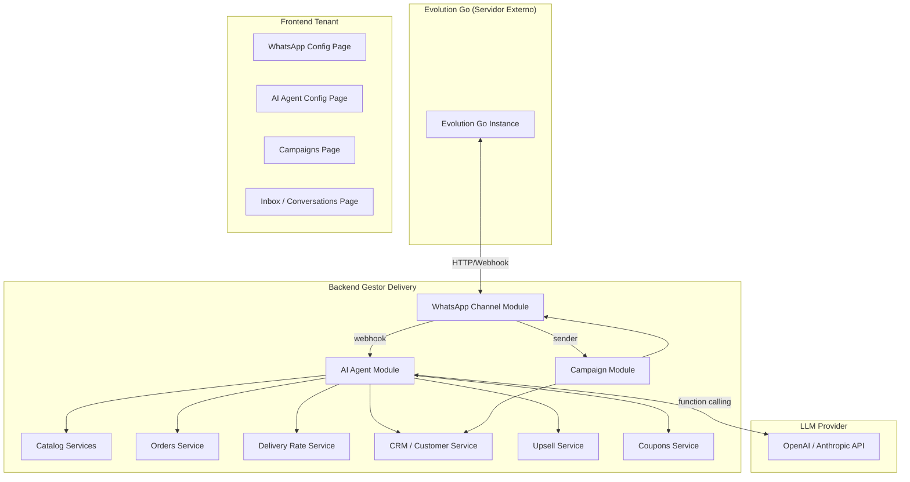

# Agente IA WhatsApp + Campanhas — Gestor Delivery SaaS PRO

## 1. Diagnóstico da Base Atual

### Módulos reutilizáveis (sem duplicação)

| Módulo | Status | Reaproveitamento |
|---|---|---|
| **Catálogo** (Product, Category, Combos, Complements, Options) | ✅ Completo | Direto — `StorefrontService.getStorefrontPayload()` já monta payload público |
| **Upsells** (Upsell, UpsellItem, ProductUpsell) | ✅ Completo | Direto — `UpsellsService` com cálculo de preço |
| **CRM** (Customer, segmentação RFM) | ✅ Completo | Direto — `CrmSegmentationService` + `CustomerService.syncCustomerOnOrderUpsert()` |
| **Cupons** (Coupon, OrderCoupon) | ✅ Completo | Direto — `CouponsService.validateCouponForTotal()` |
| **Cashback** (CashbackTransaction) | ✅ Completo | Direto — `CashbackService` |
| **Pedidos** (Order, OrderItem, timeline) | ✅ Completo | Direto — `OrdersService.createOrder()` com idempotência |
| **Checkout Validator** | ✅ Completo | Direto — `CheckoutValidatorService.validate()` |
| **Taxa de Entrega** (DeliveryRateRule, Coverage) | ✅ Completo | Direto — `DeliveryRateService.calculateDeliveryDecision()` |
| **Disponibilidade** (Publication, AvailabilityRules) | ✅ Completo | Direto — `AvailabilityService.decide()` |
| **Horários** (TenantOperatingHours) | ✅ Completo | Direto — store status |
| **Analytics** | ✅ Completo | Extensível — `AnalyticsService` |
| **AuditLog** | ✅ Completo | Direto |
| **Auth Cliente** (CustomerOTP) | ✅ Completo | Adaptável — identificação por phone |
| **WhatsApp existente** | ⚠️ Básico | **Substituir** — usa Meta Cloud API, precisamos Evolution Go |
| **Campanhas/Promos** | ❌ Não existe | **Criar do zero** |

### O que precisa ser substituído

O módulo `notifications/whatsapp.service.ts` atual usa Meta Cloud API (`graph.facebook.com`). Será **substituído** por integração Evolution Go. O `WhatsappWebhookController` atual também é para Meta — será substituído.

### Riscos de duplicidade identificados

- **CRM**: Não duplicar — sessão de conversa referencia `Customer` existente
- **Pedidos**: Não duplicar — agente IA chama `OrdersService.createOrder()` existente
- **Catálogo**: Não duplicar — agente consulta via services existentes
- **Preços**: Nunca inventar — sempre do backend

---

## 2. Estratégia de Arquitetura



### Princípios

1. **Evolution Go** = camada de transporte (enviar/receber mensagens, QR, status)
2. **Backend** = fonte de verdade (catálogo, preços, pedidos, CRM, campanhas)
3. **LLM** = camada de inteligência (entender intenção, gerar texto, chamar tools)
4. **Frontend** = painel de controle (config, inbox, campanhas, analytics)

---

## 3. Alterações Propostas por Componente

### Componente A — WhatsApp Channel Module (NOVO)

> [!IMPORTANT]
> Substitui completamente o `notifications/whatsapp.service.ts` e `whatsapp-webhook.controller.ts` existentes.

#### [NEW] `apps/api/src/whatsapp-channel/whatsapp-channel.module.ts`
Módulo NestJS que encapsula toda integração com Evolution Go.

#### [NEW] `apps/api/src/whatsapp-channel/whatsapp-instance.service.ts`
- CRUD de instâncias Evolution Go por tenant
- Armazena `instanceName`, `apiUrl`, `apiKey`, `webhookUrl`, `status`
- Métodos: `getInstance(tenantId)`, `createInstance()`, `getConnectionStatus()`, `getQrCode()`

#### [NEW] `apps/api/src/whatsapp-channel/whatsapp-sender.service.ts`
- Envia mensagens via Evolution Go REST API
- Métodos: `sendText(instanceName, to, text)`, `sendMedia()` (preparado)
- Rate limiting interno, retry com backoff, idempotência por `messageId`

#### [NEW] `apps/api/src/whatsapp-channel/whatsapp-webhook.controller.ts`
- `POST /api/v1/webhooks/evolution/:instanceName`
- Valida signature/apikey
- Parseia eventos: `messages.upsert`, `connection.update`, `messages.update`
- Emite eventos internos via `EventEmitter2`
- Idempotência por `messageId`

#### [NEW] `apps/api/src/whatsapp-channel/dto/`
- `EvolutionWebhookPayload`, `SendMessageDto`, `InstanceConfigDto`, `ConnectionStatusDto`

#### [MODIFY] `apps/api/src/notifications/whatsapp.service.ts`
- Refatorar para usar `WhatsAppSenderService` em vez de Meta Cloud API
- Mantém interface `notifyOrderStatus()` compatível

---

### Componente B — AI Agent Module (NOVO)

#### [NEW] `apps/api/src/ai-agent/ai-agent.module.ts`

#### [NEW] `apps/api/src/ai-agent/conversation.service.ts`
- Gerencia sessões conversacionais por `(tenantId, customerPhone)`
- Estados: `greeting`, `browsing_menu`, `building_cart`, `collecting_address`, `awaiting_confirmation`, `order_created`, `handoff_human`, `closed`
- Persiste em `ChatSession` + `ChatMessage` (Prisma)
- TTL de sessão (ex: 2h de inatividade → fecha)

#### [NEW] `apps/api/src/ai-agent/ai-orchestrator.service.ts`
- Recebe mensagem do cliente, carrega contexto da sessão
- Monta system prompt com dados do tenant (nome, horários, políticas)
- Chama LLM com function calling (tools internas)
- Processa tool calls, executa no backend, retorna resposta
- Decide handoff humano quando confiança baixa ou cliente pede

#### [NEW] `apps/api/src/ai-agent/agent-tools.service.ts`
- Implementa as tools que o LLM pode chamar:
  - `searchCatalog(query)` → usa `StorefrontService` / Prisma
  - `getProductDetails(productId)` → detalhes + complementos + upsells
  - `getCombos()` → combos ativos do tenant
  - `getUpsells(productId)` → `ProductUpsell` linkados
  - `calculateDeliveryFee(lat, lng)` → `DeliveryRateService`
  - `addToCart(items)` → atualiza carrinho na sessão
  - `removeFromCart(itemIndex)` → remove item
  - `getCartSummary()` → resumo com totais
  - `createOrder(confirmationData)` → `OrdersService.createOrder()`
  - `getOrderStatus(orderNumber)` → status do pedido
  - `handoffToHuman(reason)` → muda estado para handoff

#### [NEW] `apps/api/src/ai-agent/handoff.service.ts`
- Controla transição bot ↔ humano
- Campos: `handoffAt`, `handoffReason`, `humanOperatorId`, `botResumedAt`
- Bloqueio temporário do bot após handoff (configurável por tenant)
- Auditoria de quem assumiu

#### [NEW] `apps/api/src/ai-agent/ai-agent-config.service.ts`
- Configuração por tenant: `isEnabled`, `systemPrompt`, `tone`, `operatingHours`, `maxRetries`, `handoffPolicy`, `greetingMessage`, `fallbackMessage`

#### [NEW] `apps/api/src/ai-agent/recommendation.service.ts`
- Motor de recomendação que reaproveita dados existentes:
  1. `ProductUpsell` cadastrados → prioridade máxima
  2. `UpsellItem` → itens sugeridos
  3. Heurística por categoria (se pediu pizza, sugere bebida)
- Nunca inventa preço — sempre do catálogo

---

### Componente C — Campaign Module (NOVO)

#### [NEW] `apps/api/src/campaigns/campaigns.module.ts`

#### [NEW] `apps/api/src/campaigns/campaigns.service.ts`
- CRUD de campanhas por tenant
- Segmentação de audiência usando `CrmSegmentationService`
- Agendamento de disparos
- Controle de rate limit por tenant

#### [NEW] `apps/api/src/campaigns/campaign-dispatcher.service.ts`
- Processa fila de disparo
- Usa `WhatsAppSenderService` para enviar
- Registra status por destinatário: `queued`, `sent`, `delivered`, `read`, `failed`
- Deduplicação, opt-out check, janela de envio

#### [NEW] `apps/api/src/campaigns/campaign-analytics.service.ts`
- Métricas: enviadas, entregues, lidas, respondidas, convertidas em pedido
- Conversão = pedido criado dentro de janela de atribuição (ex: 48h após receber)

#### [NEW] `apps/api/src/campaigns/campaigns.controller.ts`
- REST API: CRUD campanha, preview audiência, disparar, pausar, cancelar, métricas

---

### Componente D — Modelos Prisma (NOVO)

#### [MODIFY] `apps/api/prisma/schema.prisma`

Novos models:

```prisma
// ===== WhatsApp Channel =====
model WhatsAppInstance {
  id             String   @id @default(uuid())
  tenantId       String   @unique @map("tenant_id")
  instanceName   String   @unique @map("instance_name") @db.VarChar(100)
  apiUrl         String   @map("api_url") @db.VarChar(500)
  apiKey         String   @map("api_key") @db.VarChar(500)
  phoneNumber    String?  @map("phone_number") @db.VarChar(30)
  status         WhatsAppInstanceStatus @default(disconnected)
  webhookSecret  String?  @map("webhook_secret") @db.VarChar(255)
  createdAt      DateTime @default(now()) @map("created_at")
  updatedAt      DateTime @updatedAt @map("updated_at")
  tenant         Tenant   @relation(fields: [tenantId], references: [id], onDelete: Cascade)
  @@map("whatsapp_instances")
}

// ===== AI Agent =====
model ChatSession {
  id              String        @id @default(uuid())
  tenantId        String        @map("tenant_id")
  customerPhone   String        @map("customer_phone") @db.VarChar(30)
  customerId      String?       @map("customer_id")
  state           ChatState     @default(greeting)
  cartData        Json?         @map("cart_data")
  handoffActive   Boolean       @default(false) @map("handoff_active")
  handoffOperator String?       @map("handoff_operator")
  handoffAt       DateTime?     @map("handoff_at")
  lastMessageAt   DateTime      @default(now()) @map("last_message_at")
  closedAt        DateTime?     @map("closed_at")
  createdAt       DateTime      @default(now()) @map("created_at")
  updatedAt       DateTime      @updatedAt @map("updated_at")
  messages        ChatMessage[]
  tenant          Tenant        @relation(fields: [tenantId], references: [id], onDelete: Cascade)
  customer        Customer?     @relation(fields: [customerId], references: [id])
  @@unique([tenantId, customerPhone])
  @@index([tenantId])
  @@index([tenantId, state])
  @@map("chat_sessions")
}

model ChatMessage {
  id            String      @id @default(uuid())
  sessionId     String      @map("session_id")
  direction     MessageDirection
  content       String
  messageType   String      @default("text") @map("message_type") @db.VarChar(20)
  externalId    String?     @unique @map("external_id") @db.VarChar(100)
  toolCalls     Json?       @map("tool_calls")
  metadata      Json?
  createdAt     DateTime    @default(now()) @map("created_at")
  session       ChatSession @relation(fields: [sessionId], references: [id], onDelete: Cascade)
  @@index([sessionId])
  @@index([externalId])
  @@map("chat_messages")
}

model AiAgentConfig {
  id              String   @id @default(uuid())
  tenantId        String   @unique @map("tenant_id")
  isEnabled       Boolean  @default(false) @map("is_enabled")
  greetingMessage String?  @map("greeting_message")
  systemPrompt    String?  @map("system_prompt")
  tone            String   @default("friendly") @db.VarChar(30)
  operatingMode   String   @default("always") @map("operating_mode") @db.VarChar(30)
  handoffPolicy   String   @default("on_request") @map("handoff_policy") @db.VarChar(30)
  maxRetries      Int      @default(3) @map("max_retries")
  sessionTimeoutMin Int    @default(120) @map("session_timeout_min")
  createdAt       DateTime @default(now()) @map("created_at")
  updatedAt       DateTime @updatedAt @map("updated_at")
  tenant          Tenant   @relation(fields: [tenantId], references: [id], onDelete: Cascade)
  @@map("ai_agent_configs")
}

// ===== Campaigns =====
model Campaign {
  id             String           @id @default(uuid())
  tenantId       String           @map("tenant_id")
  name           String           @db.VarChar(200)
  objective      String?          @db.VarChar(100)
  status         CampaignStatus   @default(draft)
  messageTemplate String          @map("message_template")
  segmentRules   Json             @map("segment_rules")
  scheduledAt    DateTime?        @map("scheduled_at")
  startedAt      DateTime?        @map("started_at")
  completedAt    DateTime?        @map("completed_at")
  cancelledAt    DateTime?        @map("cancelled_at")
  totalAudience  Int              @default(0) @map("total_audience")
  totalSent      Int              @default(0) @map("total_sent")
  totalDelivered Int              @default(0) @map("total_delivered")
  totalRead      Int              @default(0) @map("total_read")
  totalReplied   Int              @default(0) @map("total_replied")
  totalConverted Int              @default(0) @map("total_converted")
  totalOptOut    Int              @default(0) @map("total_opt_out")
  createdAt      DateTime         @default(now()) @map("created_at")
  updatedAt      DateTime         @updatedAt @map("updated_at")
  tenant         Tenant           @relation(fields: [tenantId], references: [id], onDelete: Cascade)
  dispatches     CampaignDispatch[]
  @@index([tenantId])
  @@index([tenantId, status])
  @@map("campaigns")
}

model CampaignDispatch {
  id          String                @id @default(uuid())
  campaignId  String                @map("campaign_id")
  customerId  String                @map("customer_id")
  phone       String                @db.VarChar(30)
  status      CampaignDispatchStatus @default(queued)
  sentAt      DateTime?             @map("sent_at")
  deliveredAt DateTime?             @map("delivered_at")
  readAt      DateTime?             @map("read_at")
  repliedAt   DateTime?             @map("replied_at")
  failReason  String?               @map("fail_reason")
  externalId  String?               @map("external_id") @db.VarChar(100)
  createdAt   DateTime              @default(now()) @map("created_at")
  campaign    Campaign              @relation(fields: [campaignId], references: [id], onDelete: Cascade)
  customer    Customer              @relation(fields: [customerId], references: [id])
  @@index([campaignId])
  @@index([customerId])
  @@index([campaignId, status])
  @@map("campaign_dispatches")
}

model CustomerOptOut {
  id         String   @id @default(uuid())
  tenantId   String   @map("tenant_id")
  customerId String   @map("customer_id")
  phone      String   @db.VarChar(30)
  reason     String?
  createdAt  DateTime @default(now()) @map("created_at")
  tenant     Tenant   @relation(fields: [tenantId], references: [id], onDelete: Cascade)
  customer   Customer @relation(fields: [customerId], references: [id])
  @@unique([tenantId, phone])
  @@map("customer_opt_outs")
}

// ===== Enums =====
enum WhatsAppInstanceStatus {
  connected
  disconnected
  connecting
  qr_pending
}

enum ChatState {
  greeting
  browsing_menu
  building_cart
  collecting_address
  awaiting_confirmation
  order_created
  handoff_human
  closed
}

enum MessageDirection {
  inbound
  outbound
}

enum CampaignStatus {
  draft
  scheduled
  running
  paused
  completed
  cancelled
}

enum CampaignDispatchStatus {
  queued
  sent
  delivered
  read
  replied
  failed
  opt_out
}
```

Novas relações no `Tenant`:
```prisma
whatsappInstance     WhatsAppInstance?
chatSessions        ChatSession[]
aiAgentConfig       AiAgentConfig?
campaigns           Campaign[]
customerOptOuts     CustomerOptOut[]
```

Novas relações no `Customer`:
```prisma
chatSessions        ChatSession[]
campaignDispatches  CampaignDispatch[]
optOuts             CustomerOptOut[]
```

---

### Componente E — Frontend (NOVO)

#### [NEW] `apps/web-tenant/src/features/whatsapp/WhatsAppConfigPage.tsx`
- Status da instância Evolution Go (connected/disconnected/qr_pending)
- QR Code para parear
- Número conectado
- Botão reconectar
- Health da conexão

#### [NEW] `apps/web-tenant/src/features/ai-agent/AiAgentConfigPage.tsx`
- Toggle ativar/desativar
- Campo de system prompt customizável
- Seletor de tom de voz
- Configuração de horários de atuação
- Política de handoff
- Mensagem de saudação
- Mensagem de fallback

#### [NEW] `apps/web-tenant/src/features/ai-agent/InboxPage.tsx`
- Lista de conversas ativas
- Indicador bot/humano por conversa
- Histórico de mensagens
- Botão "Assumir conversa" (handoff manual)
- Botão "Devolver ao bot"
- Filtros por estado

#### [NEW] `apps/web-tenant/src/features/campaigns/CampaignsPage.tsx`
- Lista de campanhas com status e métricas
- Cards de métricas globais
- Filtros por status

#### [NEW] `apps/web-tenant/src/features/campaigns/CampaignEditorPage.tsx`
- Wizard: Objetivo → Audiência → Mensagem → Preview → Agendar
- Segmentação visual (filtros de CRM)
- Preview da mensagem
- Estimativa de audiência
- Agendamento ou disparo imediato

#### [NEW] `apps/web-tenant/src/features/campaigns/CampaignDetailPage.tsx`
- Métricas detalhadas (funnel: enviadas → entregues → lidas → respondidas → convertidas)
- Lista de dispatches com status individual
- Opt-outs

#### [NEW] `apps/web-tenant/src/features/analytics/WhatsAppAnalyticsSection.tsx`
- Volume de conversas
- Taxa de atendimento automático vs handoff
- Taxa de conversão em pedido
- Ticket médio do canal WhatsApp
- Upsell acceptance rate
- Métricas de campanha agregadas

#### [MODIFY] `apps/web-tenant/src/App.tsx`
- Adicionar rotas: `/whatsapp`, `/ai-agent`, `/ai-agent/inbox`, `/campaigns`, `/campaigns/:id`, `/campaigns/new`

#### [MODIFY] `apps/web-tenant/src/layouts/AppLayout.tsx`
- Adicionar seção "WhatsApp" no sidebar com sub-itens

---

### Componente F — Analytics e Auditoria

#### [MODIFY] `apps/api/src/analytics/analytics.service.ts`
- Adicionar métricas WhatsApp: `getWhatsAppAnalytics(tenantId, dateRange)`
- Conversas, handoffs, conversão, ticket médio canal WA, upsell rate

#### Eventos auditados automaticamente via `AuditLog`:
- Mensagem recebida/enviada
- Mudança bot → humano e vice-versa
- Campanha criada/disparada/pausada/cancelada
- Opt-out registrado
- Instância conectada/desconectada
- Pedido criado via WhatsApp
- Upsell aceito/recusado

---

## 4. User Review Required

> [!IMPORTANT]
> **Provider de LLM**: O agente IA precisa de um provider de LLM (OpenAI, Anthropic, etc). Qual provider e modelo você quer usar? Vou preparar a integração com variáveis de ambiente configuráveis (`AI_PROVIDER`, `AI_API_KEY`, `AI_MODEL`).

> [!IMPORTANT]
> **Evolution Go API**: Preciso da URL base e documentação da API do seu Evolution Go. Vou implementar baseado na API padrão do Evolution API v2 (`/message/sendText`, `/instance/connectionState`, `/instance/connect`). Confirma que é compatível?

> [!WARNING]
> **Volume de arquivos**: Esta implementação envolve ~30+ arquivos novos e ~10 modificados. Recomendo executar em etapas incrementais com build validado a cada componente.

## 5. Open Questions

1. **Provider de IA**: OpenAI (GPT-4o) ou Anthropic (Claude)? Ou ambos configuráveis?
2. **Evolution Go API version**: Qual versão está rodando? (v1 ou v2?)
3. **Limite de mensagens por campanha**: Existe limite por tenant no plano SaaS?
4. **Media no WhatsApp**: Precisa enviar imagens de produtos na conversa desde o início, ou texto é suficiente para MVP?
5. **Bull/BullMQ**: O projeto já usa alguma lib de filas? Para campanhas, uma fila robusta é recomendada. Posso usar `@nestjs/bullmq` com Redis ou implementar com polling simples no banco.

---

## 6. Verificação

### Build e Lint
```bash
pnpm build
pnpm lint
```

### Migration
```bash
cd apps/api && npx prisma migrate dev --name add_whatsapp_ai_campaigns
npx prisma generate
```

### Testes Manuais
1. **WhatsApp Channel**: Configurar instância → verificar QR → enviar mensagem teste
2. **AI Agent**: Enviar mensagem via WhatsApp → verificar resposta do bot → navegar cardápio → criar pedido
3. **Handoff**: Pedir atendimento humano → verificar bloqueio do bot → devolver ao bot
4. **Campanha**: Criar campanha → selecionar audiência → disparar → verificar métricas
5. **Opt-out**: Responder "SAIR" → verificar bloqueio de futuras campanhas

### Checklist Final
- [ ] Integração Evolution Go funcionando
- [ ] Webhooks funcionando
- [ ] Envio de mensagem funcionando
- [ ] Agente IA funcionando
- [ ] Handoff humano funcionando
- [ ] Pedido por WhatsApp funcionando
- [ ] Upsell/combo funcionando
- [ ] Campanhas funcionando
- [ ] Opt-out funcionando
- [ ] Analytics mínimos funcionando
- [ ] Multi-tenant OK
- [ ] Tipagem OK
- [ ] Lint/ESLint OK
- [ ] Build OK

---

## 7. Ordem de Execução Proposta

| Etapa | Componente | Estimativa |
|---|---|---|
| 1 | Schema Prisma + migrate | Primeiro |
| 2 | WhatsApp Channel Module | Segundo |
| 3 | AI Agent Module (core) | Terceiro |
| 4 | Agent Tools + Recommendation | Quarto |
| 5 | Handoff Service | Quinto |
| 6 | Campaign Module | Sexto |
| 7 | Frontend Pages | Sétimo |
| 8 | Analytics + Auditoria | Oitavo |
| 9 | Build + Lint + Testes | Final |
