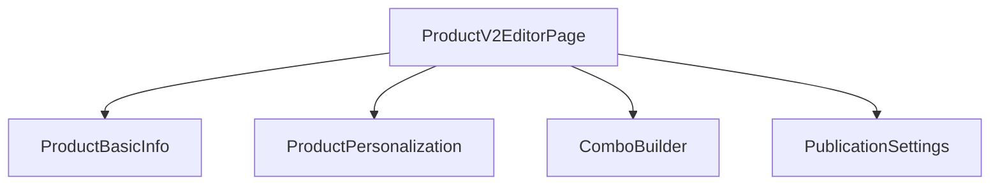

# Walkthrough: Technical Hardening Phase - Catalog V2

I have completed the technical hardening of the Catalog V2 module, focusing on modularity, type safety, and runtime validation.

## 1. Modular Decomposition of Product Editor

The monolithic [ProductV2EditorPage](file:///c:/Users/emers/Documents/GitHub/Gestor%20Delivery%20SaaS%20PRO/apps/web-tenant/src/features/catalog/ProductV2EditorPage.tsx#89-1580) (~2,500 lines) was broken down into four specialized subcomponents to improve maintainability and readability.

- **[ProductBasicInfo](file:///c:/Users/emers/Documents/GitHub/Gestor%20Delivery%20SaaS%20PRO/apps/web-tenant/src/features/catalog/SubComponents/ProductBasicInfo.tsx)**: Handles core product data, images, and pizza-specific price configurations.
- **[ProductPersonalization](file:///c:/Users/emers/Documents/GitHub/Gestor%20Delivery%20SaaS%20PRO/apps/web-tenant/src/features/catalog/SubComponents/ProductPersonalization.tsx)**: Manages complement group links and reordering.
- **[ComboBuilder](file:///c:/Users/emers/Documents/GitHub/Gestor%20Delivery%20SaaS%20PRO/apps/web-tenant/src/features/catalog/SubComponents/ComboBuilder.tsx)**: Handles combo items, slots, and pricing strategies.
- **[PublicationSettings](file:///c:/Users/emers/Documents/GitHub/Gestor%20Delivery%20SaaS%20PRO/apps/web-tenant/src/features/catalog/SubComponents/PublicationSettings.tsx)**: Manages availability rules and publication status.

### Resulting Structure


## 2. Enhanced Type Safety

- **Alignment with Prisma**: Updated the [ProductCategory](file:///c:/Users/emers/Documents/GitHub/Gestor%20Delivery%20SaaS%20PRO/packages/types/src/catalog.ts#5-21) interface in `@gestor/types` to include `templateType` and `templateConfig`, reflecting the actual database schema.
- **Strict Reordering Types**: Refined [moveLink](file:///c:/Users/emers/Documents/GitHub/Gestor%20Delivery%20SaaS%20PRO/apps/web-tenant/src/features/catalog/ProductV2EditorPage.tsx#535-546), [moveSlot](file:///c:/Users/emers/Documents/GitHub/Gestor%20Delivery%20SaaS%20PRO/apps/web-tenant/src/features/catalog/ProductV2EditorPage.tsx#628-639), and [moveAllowed](file:///c:/Users/emers/Documents/GitHub/Gestor%20Delivery%20SaaS%20PRO/apps/web-tenant/src/features/catalog/ProductV2EditorPage.tsx#713-724) function signatures to use strict literal types (`-1 | 1`) instead of generic numbers.
- **Prop Type Correction**: Standardized `savingStates` usage across all subcomponents to use `Record<string, boolean>`.

## 3. Runtime Validation with Zod

Integrated `zod` for safe parsing of dynamic JSON configurations in the backend:

- **Pizza Engine**: [PizzaEngineService](file:///c:/Users/emers/Documents/GitHub/Gestor%20Delivery%20SaaS%20PRO/apps/api/src/catalog/pizza-engine.service.ts#20-126) now uses `PizzaTemplateConfigSchema.safeParse()` to validate configurations before calculation, eliminating `as any` and potential runtime crashes from malformed JSON.

```typescript
// Example from PizzaEngineService.ts
const config = PizzaTemplateConfigSchema.safeParse(templateConfig);
if (!config.success) {
    // Falls back to safe defaults
    this.logger.warn('Invalid template config, using defaults');
}
```

## 4. Pending Verification
- [ ] Run `pnpm run build` to confirm full type integrity across the monorepo.
- [ ] Manual regression testing of the Product Editor UI tabs.

---
**Status**: Technical Hardening phase for Catalog V2 core is complete.
